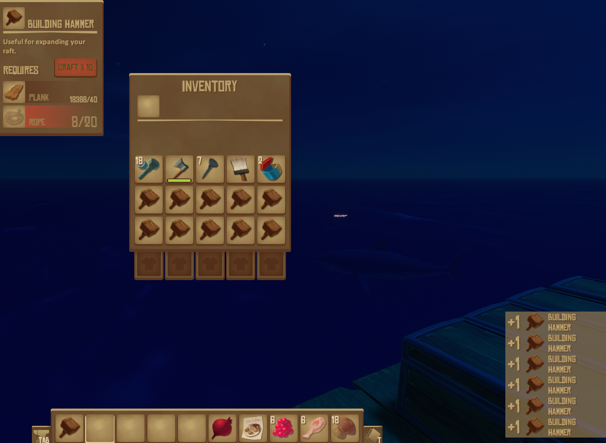

# Bulk Crafting   ![Badge Multiplayer]

*A **[Raft]** mod that adds bulk crafting.*

<br>
<br>

<div align = center>

[![Button Raft]][RaftModding]

<br>
<br>




</div>

<br>
<br>

## Features

- Holding  <kbd>  Shift  </kbd>  makes you craft  `10x` .

<br>

### Planned

- Make the amount you craft when holding shift configurable.

- Holding  <kbd>  Ctrl  </kbd>  +  <kbd>  Shift  </kbd>  makes you craft  `10`  stacks.

- Holding  <kbd>  Ctrl  </kbd>  makes you craft a stack.

<br>

### Ideas

Feel free to post suggestions for changes on the <br>
**[RaftModding Discord]** or as an **[Issue]** on **GitHub**.

<br>
<br>

## Troubleshooting

This mod is released 'as is' and may contain bugs. <br>
If you have any problems, please create an **[Issue]**.

<br>
<br>

## Building

*Build the project by executing:*

```shell
Tools/Build.bat
```

<br>


<!----------------------------------------------------------------------------->

[RaftModding Discord]: https://www.raftmodding.com/discord
[RaftModding]: https://www.raftmodding.com/mods/bulk-crafting
[Issue]: https://github.com/thmsndk/Raft-BulkCrafting/issues
[Raft]: https://raft-game.com/


<!----------------------------------[ Badges ]--------------------------------->

[Badge Multiplayer]: https://img.shields.io/badge/Multiplayer-Untested-8b2a3e.svg?style=for-the-badge&labelColor=AA344D&logColor=white&logo=AppleArcade


<!---------------------------------[ Buttons ]--------------------------------->

[Button Raft]: https://img.shields.io/badge/RaftModding-3498db?style=for-the-badge&logoColor=white&logo=Wireshark
